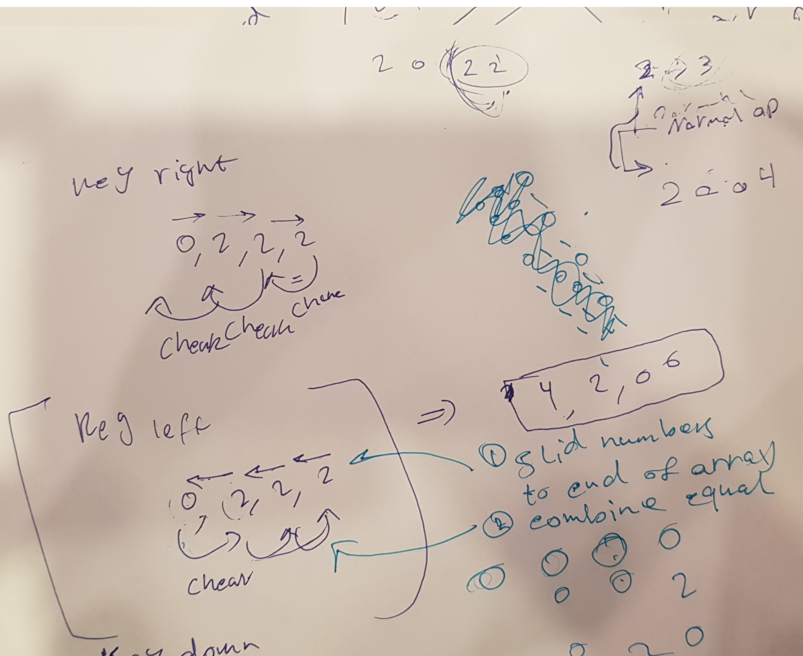
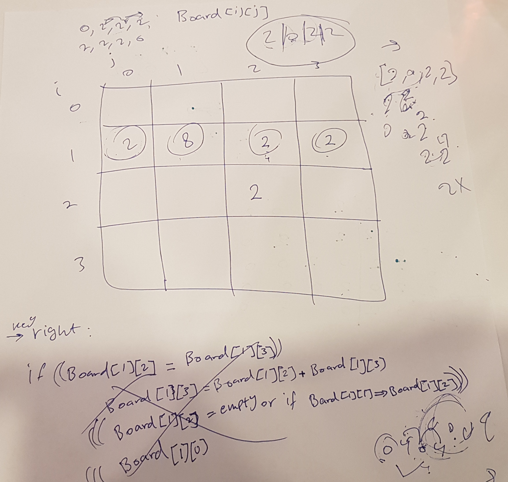

# Simple 2048

Idea of the game is to combine equal numbers in multibles of 2
till you reach 2048
you can combine in 4 directions left,Right,Up,Down

## Description

Game is about manuplating a 4x4 matrix to combine equal numbers who fall on the same row or column depending on arrow direction a 2 will randomly apper at a location where it is empty in the matrix after each click and the user will play to try and get highest score possible "2048" the game will stop if there is no equal numbers next to eachother and no empty space to be filled with 2.
### Technical Used

```

HTML
CSS
JavaScript, and jQuery for DOM manipulation

```

### Wireframes

Basicly in a row will have to move all values above 0 to direction of key press and combine equal in oppistve way and pushing to end of the row 
and the same for columes dependeing on key press



### User Stories

As a User i want to reach the highest score possible "2048" before all the boxes are filled with unequal values by smartly moving the numbers in direction of key pressed.

---

## Planning and Development Process

1. Understand how the game operates and how it behaves in case of key pressesd
2. build a 4x4 array that will be backbone of boxes represnted in front page.
3. randomize a location for 2 to pop into the empty array at a random location if location is empty 
4. if a arrow key is pressed slide numbers to end of the row or column in direction of press and combine equal numbers starting in the oppisite direction without overlaping by removing old values after combining.
5. 
### Problem-Solving Strategy

puseduocoding was of utmost importance and understanding the game mechanics and matrix manpulation tricks in JS also learning about new Javascript and jQuery methods and syntax e.g. 
$('div'), 
arr.concat, 
$(document).ready(function () {
    $("body").keydown(function (key) {
    }},
    Key Codes,
Online resources explaning the original game and matrix manuplation was very important for JS syntax 

### Unsolved problems

1. true random number generation.
2. hide zero locations.
3. put timer and number of moves next to score and save user data for later improvment.
4. put alert to stop after Game End

---

## Acknowledgments

* Ebere, Ahmed, Atheer, Yasir thank you so much for helping out with the project, espicaly Ebere for scaring me till i finished it and kickstarting the begining and cheering me to keep working on it, also Yasir cheered me on to do it!

* it felt like a fun game to work on with simple moves for user to play turned to be a hellish game for Devolper :E


---

 ## References

 1. https://thecodingtrain.com/CodingChallenges/094.1-2048.html
 2. https://api.jquery.com/
 3. https://stackoverflow.com
 4. https://www.w3schools.com
 


